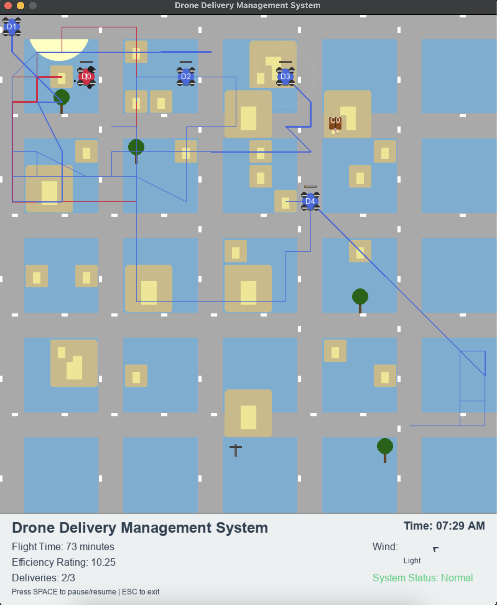
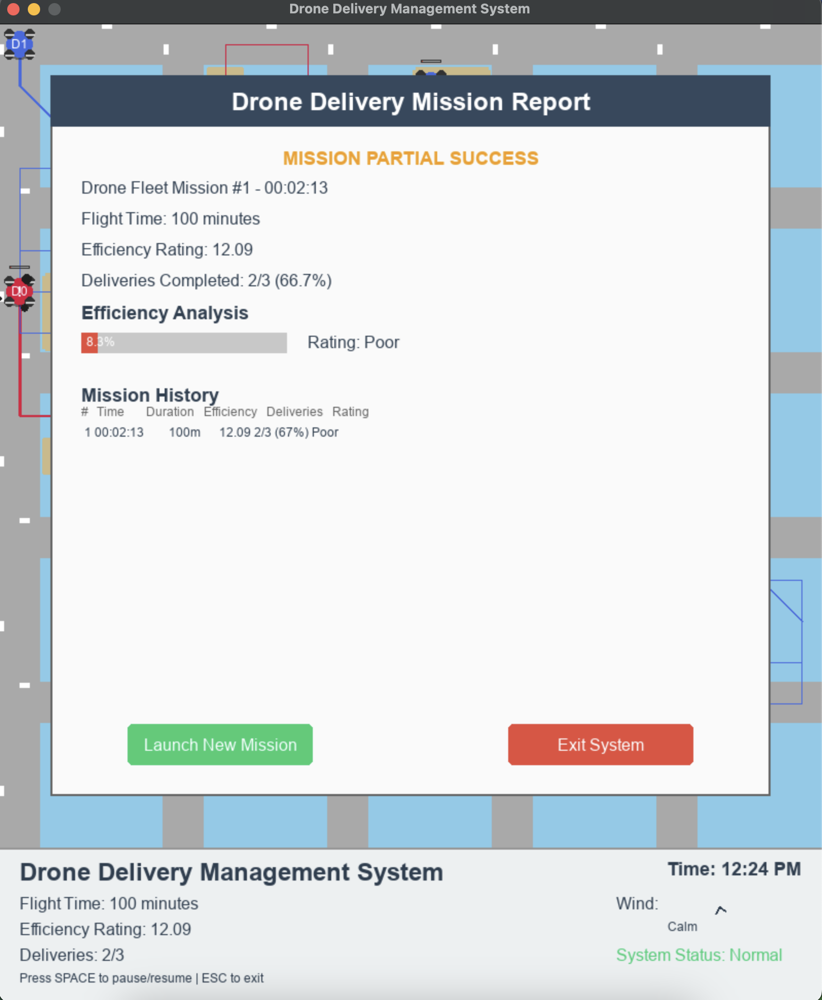
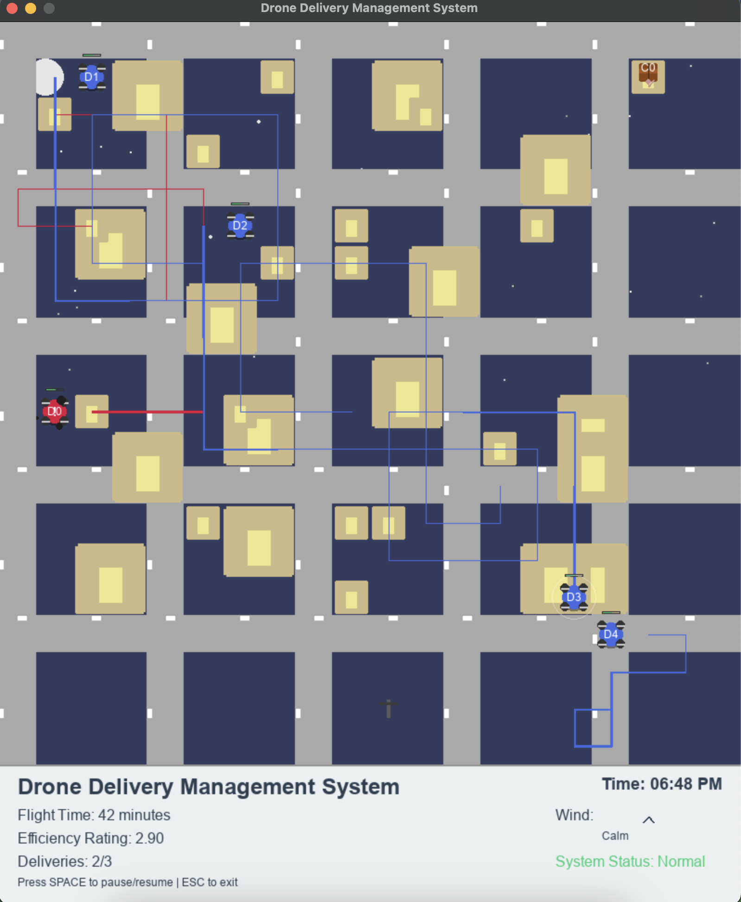

# Decentralized Delivery Coordination Simulator


A Python-based simulation for CMSI 6998 (Spring 2025) exploring online algorithms and decentralized systems. This project models autonomous delivery agents finding moving customers in a grid, coordinating without a central server, and handling a Byzantine agent spreading false data.

## 🚀 Features

- **Online Search Algorithms**: Agents use a spiral search pattern to efficiently locate moving customers when their positions are unknown.
- **Decentralized Consensus**: Agents share information and vote on customer locations locally without central coordination.
- **Byzantine Fault Tolerance**: The system can handle malicious agents that intentionally spread false information about customer positions.
- **Interactive Visualization**: Real-time Pygame visualization with color-coded elements:
  - Blue circles: Normal agents
  - Red circles: Byzantine (malicious) agents
  - Green squares: Customers awaiting delivery
  - Yellow paths: Agent movement history
- **Performance Metrics**: Real-time calculation of competitive ratio and other efficiency metrics.
- **Dashboard Display**: Interactive dashboard showing simulation statistics and agent performance.

## 📋 Requirements

- Python 3.11+
- Dependencies:
  - `pygame >= 2.6.0`: For visualization
  - `numpy >= 1.24.0`: For mathematical operations
  - `scipy >= 1.10.0`: For distance calculations

## 🔧 Installation

```bash
# Clone the repository
git clone https://github.com/gemechutaye/DecentralizedDeliverySim.git

# Navigate to the project directory
cd DecentralizedDeliverySim

# Install dependencies
pip install -r requirements.txt
```

## 🎮 How to Run

```bash
python main.py
```

### Controls
- **Close Window**: Click the X or press ESC to exit
- **Pause/Resume**: Press SPACE to toggle simulation pause
- **Restart**: Press R to restart the simulation (if implemented)

## 📸 Screenshots

### Simulation View

*Simulation grid showing drones (blue/red circles), paths (colored lines), and buildings (yellow blocks)*


*Simulation showing customer locations (green circles) and drone delivery paths*

### Mission Report

*End of mission report showing delivery statistics and efficiency metrics*

## 🧩 Project Structure

- **`main.py`**: Entry point that initializes the environment, agents, and runs the simulation loop.
- **`environment.py`**: Manages the grid world, customer positions, and environment dynamics.
- **`agent.py`**: Defines agent behavior including movement patterns, knowledge representation, and decision-making.
- **`consensus.py`**: Implements the decentralized consensus algorithm for knowledge sharing among agents.
- **`visualize.py`**: Handles all visualization aspects including the grid, agents, customers, and dashboard.
- **`metrics.py`**: Calculates performance metrics such as competitive ratio to evaluate agent efficiency.

## 📊 Simulation Parameters

- **Grid Size**: 20x20 cells
- **Agents**: 5 total (4 normal, 1 Byzantine)
- **Customers**: 3 randomly placed on the grid
- **Maximum Steps**: 100 (simulation ends after this many steps)
- **Byzantine Agent**: Agent 0 is designated as Byzantine and may spread false information

## 🔍 Implementation Details

### Agent Behavior
Agents use a combination of strategies:
1. **Target-seeking**: When a customer location is known, agents move directly toward it.
2. **Spiral Search**: When no customer locations are known, agents perform an outward spiral search pattern.
3. **Knowledge Sharing**: When agents are within communication range, they share customer location information.

### Consensus Algorithm
The consensus mechanism filters potentially false information:
1. Agents share observed customer locations with nearby agents.
2. Each agent maintains a belief system about customer locations.
3. Majority voting is used to filter out false information from Byzantine agents.

### Visualization
The visualization system provides:
1. Real-time rendering of the grid, agents, and customers.
2. Path visualization showing agent movement history.
3. Dashboard with performance metrics and simulation statistics.
4. Color-coding to distinguish between normal and Byzantine agents.

## 🛠️ Recent Updates

- Fixed color format issues in visualization for proper rendering with alpha values
- Updated competitive ratio calculation to handle edge cases
- Added missing math module import in main.py
- Improved dashboard visualization with proper text colors
- Added requirements.txt for easier dependency management

## 🔮 Future Enhancements

- Scale to larger numbers of agents and customers
- Implement more sophisticated Byzantine behaviors
- Add delivery completion animations and scoring
- Optimize consensus algorithms for larger grids
- Implement different agent strategies for comparison

## 📄 License

This project is licensed under the MIT License - see the LICENSE file for details.

---

Created by Gemechu Taye for CMSI 6998, Spring 2025.
GitHub: [gemechutaye/DecentralizedDeliverySim](https://github.com/gemechutaye/DecentralizedDeliverySim)